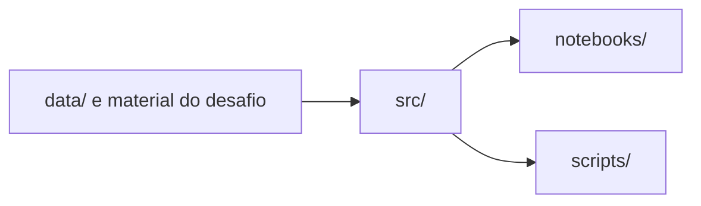

# Arquitetura

O bootstrap separa o código reutilizável, a exploração, os entrypoints e a
documentação. Os arquivos originais do desafio permanecem em
`material_desafio_jusbrasil_bracis/`; `data/` documenta essa decisão sem criar
uma cópia do SQLite.

| Diretório | Responsabilidade atual |
| --- | --- |
| `src/` | Código reutilizável, incluindo a conexão SQLite read-only. |
| `notebooks/` | Exploração visual e experimentos executáveis. |
| `scripts/` | Comandos utilitários e reproduzíveis. |
| `data/` | Documentação da localização dos arquivos distribuídos. |
| `docs/` | Decisões e documentação renderizada pelo MkDocs. |

## Limites desta etapa

Ainda não existem parsing de citações, normalização, índice canônico ou
resolução. Esses componentes poderão ser adicionados futuramente em `src/`,
quando houver uma decisão de implementação baseada na exploração do banco.
