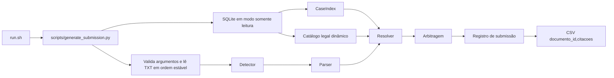
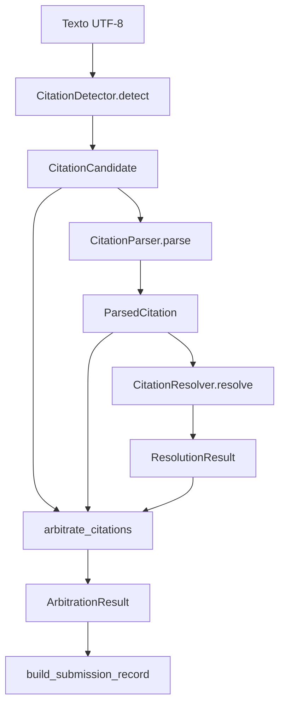

# Arquitetura

A aplicação é um pipeline offline e determinístico. Para cada execução, ela
recebe o banco e os textos informados na linha de comando, abre o banco em modo
somente leitura e produz um CSV. Não consulta rede, APIs, modelos externos,
gold público ou scorer durante a geração.

## Visão do fluxo

Use a roda do mouse, os botões ou arraste o diagrama para ampliar e navegar.

## Entrada e inicialização

`run.sh` exige exatamente três argumentos e chama
`scripts/generate_submission.py`. O script verifica o SQLite e o diretório de
TXT, lê somente arquivos `*.txt`, ordena-os por nome e preserva o stem de cada
arquivo como `documento_id`.

A conexão SQLite usa `mode=ro`. Durante a inicialização, `build_case_index`
constrói o índice de acórdãos por tribunal e número normalizado. O
`CitationResolver` também deriva do mesmo banco o catálogo de dispositivos
legais. Assim, a resolução usa a cobertura do banco recebido, sem IDs legais
fixos no runtime.

## Processamento por documento

### Detector

`CitationDetector` localiza spans literais de processos e recursos, números
CNJ, súmulas, referências legais e referências jurisprudenciais contextualizadas.
Ele ordena e remove apenas candidatos com o mesmo intervalo exato. O detector
não abre o banco e não atribui a classificação final.

### Parser

`CitationParser` transforma cada candidato em campos estruturados: família,
tipo, tribunal explícito, número processual e demais dados presentes no próprio
span. Para referências legais, preserva artigo, complementos, diploma e sinais
de ambiguidade ou OCR crítico. O parser não consulta o corpus.

### Resolver

`CitationResolver` consulta os índices derivados do SQLite da execução e retorna
um estado imutável:

| estado interno | classificação CSV |
| --- | --- |
| `resolved` | `real` |
| `no_match` | `inventada` |
| `ambiguous` | `incompleta` |
| `insufficient` | `incompleta` |

A resolução só escolhe um `id_canonico` quando a identidade é única e compatível
com os guards estruturais. Ausência de dados, conflito ou múltiplas identidades
mantêm a abstinência.

### Arbitragem

`arbitrate_citations` executa duas proteções finais: trata referências CNJ que
pertencem ao processo da própria peça e une spans estruturais compatíveis quando
representam a mesma referência. Em seguida, mantém apenas a forma legal mais
completa quando um span legal menor está contido com segurança no maior. A saída
permanece ordenada por posição no texto.

## Serialização

`build_submission_record` aplica a confiança global `0.85` aos resultados finais.
`write_submission_csv` ordena os documentos e escreve somente as colunas
`documento_id,citacoes`. O CSV representa spans nos offsets Unicode do TXT
original. `fim` é exclusivo.

## Propriedades operacionais

- **Determinismo:** TXT, candidatos e registros são ordenados antes da saída.
- **Isolamento:** o SQLite é aberto somente para leitura.
- **Portabilidade:** o entrypoint não depende do diretório atual.
- **Cobertura dinâmica:** índices de acórdãos e dispositivos vêm do banco da execução.
- **Falha segura:** uma identidade insuficiente ou ambígua não recebe ID arbitrário.
