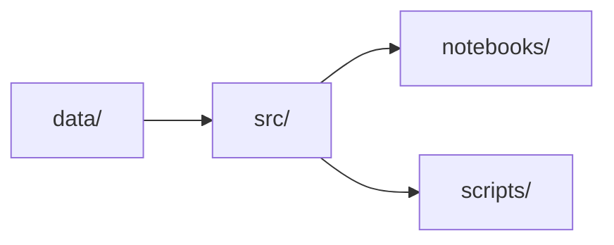

# Bootstrap inicial — Implementation Plan

> **For agentic workers:** REQUIRED SUB-SKILL: Use superpowers:subagent-driven-development (recommended) or superpowers:executing-plans to implement this plan task-by-task. Steps use checkbox (`- [ ]`) syntax for tracking.

**Goal:** Estruturar o projeto Python e criar uma exploração visual e exclusivamente read-only do SQLite canônico.

**Architecture:** O material original permanece em `material_desafio_jusbrasil_bracis/`; uma API pequena no pacote `src/` localiza e abre o SQLite por URI `mode=ro`. O script e o notebook importam essa API, e a documentação descreve apenas os componentes existentes.

**Tech Stack:** Python 3.11+, setuptools, sqlite3, unittest, JupyterLab, ipykernel, pandas, matplotlib, MkDocs Material.

**Spec:** `docs/superpowers/specs/2026-08-27-bootstrap-inicial-design.md`

## Global Constraints

- Python >= 3.11, setuptools e layout `src/`; sem Poetry, uv, Conda, SQLAlchemy ou ORM.
- `requirements.txt`: somente `-e .`, JupyterLab, ipykernel, pandas e matplotlib.
- Não copiar ou criar links para o SQLite; os dados permanecem em `material_desafio_jusbrasil_bracis/`.
- Conexões desta etapa usam URI SQLite `mode=ro`; sem DDL, DML ou persistência de resultados.
- Não criar parser, normalizador, índice canônico, classificador ou resolvedor de citações.
- O notebook não usa `sys.path`, não depende de estado oculto e não usa o goldenset para construir lógica.

---

## Estrutura de arquivos

| Caminho | Responsabilidade |
| --- | --- |
| `pyproject.toml`, `requirements.txt` | Instalação editável e dependências mínimas. |
| `src/bracis_jusbrasil/database.py` | Descoberta do material e SQLite read-only. |
| `tests/test_database.py` | Contrato da API do banco. |
| `scripts/inspect_database.py` | Sanity check reprodutível. |
| `tests/test_inspect_database.py` | Contrato de saída do script. |
| `README.md`, `data/README.md`, `docs/*.md` | Bootstrap e documentação navegável. |
| `notebooks/01_database_overview.ipynb` | Exploração canônica executável. |
| `tests/test_notebook_structure.py` | Estrutura e garantias básicas do notebook. |

### Task 1: Pacote instalável e acesso SQLite read-only

**Files:**
- Create: `pyproject.toml`, `requirements.txt`
- Create: `src/bracis_jusbrasil/__init__.py`, `src/bracis_jusbrasil/database.py`
- Create: `tests/test_database.py`

**Interfaces:**
- Produces: `get_challenge_data_dir() -> Path`, `get_database_path() -> Path`, `connect_database(path: str | Path, read_only: bool = True) -> sqlite3.Connection`.
- Consumed by: script e notebook nas tarefas posteriores.

- [ ] **Step 1: Escrever o teste que define o contrato read-only**

```python
import sqlite3
import unittest

from bracis_jusbrasil.database import connect_database, get_database_path


class DatabaseTests(unittest.TestCase):
    def test_database_path_exists(self) -> None:
        self.assertTrue(get_database_path().is_file())

    def test_read_only_connection_returns_rows_and_rejects_writes(self) -> None:
        with connect_database(get_database_path()) as connection:
            row = connection.execute("SELECT COUNT(*) AS total FROM documentos").fetchone()
            self.assertIsInstance(row, sqlite3.Row)
            self.assertEqual(row["total"], 1018)
            with self.assertRaises(sqlite3.OperationalError):
                connection.execute("CREATE TABLE bootstrap_must_not_write (id INTEGER)")

    def test_missing_database_does_not_create_file(self) -> None:
        with self.assertRaises(FileNotFoundError):
            connect_database("does-not-exist.db")
```

- [ ] **Step 2: Confirmar a falha inicial**

Run: `python -m unittest tests.test_database -v`

Expected: FAIL por ausência do pacote.

- [ ] **Step 3: Criar configuração e implementação mínima**

```toml
# pyproject.toml
[build-system]
requires = ["setuptools>=68"]
build-backend = "setuptools.build_meta"

[project]
name = "bracis-jusbrasil"
version = "0.1.0"
description = "Bootstrap read-only para o desafio BRACIS Jusbrasil"
requires-python = ">=3.11"

[tool.setuptools]
package-dir = {"" = "src"}

[tool.setuptools.packages.find]
where = ["src"]
```

```text
# requirements.txt
-e .
jupyterlab
ipykernel
pandas
matplotlib
```

```python
# src/bracis_jusbrasil/database.py
from __future__ import annotations

import sqlite3
from pathlib import Path

PROJECT_ROOT = Path(__file__).resolve().parents[2]
CHALLENGE_DATA_DIR = PROJECT_ROOT / "material_desafio_jusbrasil_bracis"
DATABASE_NAME = "desafio1_bracis.db"


def get_challenge_data_dir() -> Path:
    if not CHALLENGE_DATA_DIR.is_dir():
        raise FileNotFoundError(f"Diretório do material não encontrado: {CHALLENGE_DATA_DIR}")
    return CHALLENGE_DATA_DIR


def get_database_path() -> Path:
    path = get_challenge_data_dir() / DATABASE_NAME
    if not path.is_file():
        raise FileNotFoundError(f"Banco SQLite não encontrado: {path}")
    return path


def connect_database(path: str | Path, read_only: bool = True) -> sqlite3.Connection:
    database_path = Path(path).expanduser().resolve()
    if not database_path.is_file():
        raise FileNotFoundError(f"Banco SQLite não encontrado: {database_path}")
    connection = sqlite3.connect(
        database_path.as_uri() + "?mode=ro", uri=True
    ) if read_only else sqlite3.connect(database_path)
    connection.row_factory = sqlite3.Row
    return connection
```

```python
# src/bracis_jusbrasil/__init__.py
"""Ferramentas de exploração para o desafio BRACIS Jusbrasil."""
__version__ = "0.1.0"
```

- [ ] **Step 4: Instalar e comprovar o contrato**

Run: `python -m pip install -e . && python -m unittest tests.test_database -v`

Expected: PASS nos três testes; não existe `does-not-exist.db` ao final.

- [ ] **Step 5: Commit**

```bash
git add pyproject.toml requirements.txt src tests/test_database.py
git commit -m "feat: adicionar acesso SQLite read-only"
```

### Task 2: Sanity check reprodutível

**Files:**
- Create: `scripts/inspect_database.py`
- Create: `tests/test_inspect_database.py`

**Interfaces:**
- Consumes: `get_database_path` e `connect_database` da Task 1.
- Produces: processo CLI código 0 com integridade, natureza, tribunal e FTS5.

- [ ] **Step 1: Escrever o teste de ponta a ponta do script**

```python
import subprocess
import sys
import unittest


class InspectDatabaseScriptTests(unittest.TestCase):
    def test_script_reports_database_summary(self) -> None:
        result = subprocess.run([sys.executable, "scripts/inspect_database.py"], capture_output=True, text=True)
        self.assertEqual(result.returncode, 0, result.stderr)
        for expected in ("integrity_check: ok", "documentos: 1018", "acordao: 1000", "sumula: 5", "dispositivo: 13", "STF: 200", "FTS5: available"):
            self.assertIn(expected, result.stdout)
```

- [ ] **Step 2: Confirmar a falha inicial**

Run: `python -m unittest tests.test_inspect_database -v`

Expected: FAIL porque o script não existe.

- [ ] **Step 3: Implementar o script sem escrita**

```python
from bracis_jusbrasil.database import connect_database, get_database_path


def main() -> None:
    path = get_database_path()
    with connect_database(path) as connection:
        integrity = connection.execute("PRAGMA integrity_check").fetchone()[0]
        total = connection.execute("SELECT COUNT(*) FROM documentos").fetchone()[0]
        by_natureza = connection.execute("SELECT natureza, COUNT(*) AS total FROM documentos GROUP BY natureza ORDER BY natureza").fetchall()
        by_tribunal = connection.execute("SELECT tribunal, COUNT(*) AS total FROM documentos WHERE natureza = 'acordao' GROUP BY tribunal ORDER BY tribunal").fetchall()
        fts = connection.execute("SELECT 1 FROM sqlite_master WHERE type = 'table' AND name = 'documentos_fts'").fetchone()
    print(f"Database: {path}")
    print(f"integrity_check: {integrity}\n\ndocumentos: {total}")
    for row in by_natureza:
        print(f"{row['natureza']}: {row['total']}")
    print()
    for row in by_tribunal:
        print(f"{row['tribunal']}: {row['total']}")
    print(f"\nFTS5: {'available' if fts else 'unavailable'}")


if __name__ == "__main__":
    main()
```

- [ ] **Step 4: Verificar script e teste**

Run: `python -m unittest tests.test_inspect_database -v && python scripts/inspect_database.py`

Expected: PASS e saída concisa com as contagens esperadas.

- [ ] **Step 5: Commit**

```bash
git add scripts/inspect_database.py tests/test_inspect_database.py
git commit -m "feat: adicionar sanity check do banco"
```

### Task 3: Documentação, diretórios e navegação MkDocs

**Files:**
- Create: `README.md`, `data/README.md`, `docs/architecture.md`, `docs/notebooks.md`, `docs/scripts.md`
- Modify: `docs/index.md`, `mkdocs.yml`, `.gitignore`

**Interfaces:**
- Consumes: comandos e API das Tasks 1 e 2.
- Produces: instruções de bootstrap e site navegável.

- [ ] **Step 1: Criar README e referência dos dados**

`README.md` contém somente `Projeto` (2–4 linhas), `Estrutura`, `Bootstrap`,
`Jupyter` e `Sanity check`, com estes comandos literais:

```bash
python -m venv .venv
source .venv/bin/activate
pip install -r requirements.txt
jupyter lab
python scripts/inspect_database.py
```

`data/README.md` declara que DB, goldenset e `txt/` estão em
`../material_desafio_jusbrasil_bracis/`, que não existe cópia em `data/` e
que o banco é aberto read-only.

- [ ] **Step 2: Criar as três páginas de documentação**

`docs/architecture.md` explica a responsabilidade de `src/`, `notebooks/`,
`scripts/`, `data/` e `docs/`, contém o diagrama abaixo e afirma que parsing,
normalização, índice canônico e resolução ainda não existem:



`docs/notebooks.md` define o padrão `NN_nome_descritivo.ipynb`, registra que
notebooks são exploração e não lógica reutilizável, e descreve
`01_database_overview.ipynb` como entendimento do SQLite antes da resolução.

`docs/scripts.md` registra objetivo, comando `python scripts/inspect_database.py`,
saída esperada e garantia read-only do script.

- [ ] **Step 3: Atualizar índice, navegação e ignores**

Adicionar ao `docs/index.md` links para `architecture.md`, `notebooks.md`,
`scripts.md` e `../data/README.md`, preservando o inventário. Em `mkdocs.yml`,
manter `O desafio: index.md` como primeiro item e incluir, nessa ordem,
`Arquitetura`, `Notebooks` e `Scripts`. Ao final de `.gitignore`, acrescentar:

```gitignore
# Artefatos temporários de exploração
.jupyter_cache/
*.tmp
```

- [ ] **Step 4: Validar o site**

Run: `mkdocs build --strict --site-dir /tmp/bracis_jusbrasil_docs_site`

Expected: build concluído sem erro de página, link ou Mermaid.

- [ ] **Step 5: Commit**

```bash
git add README.md data docs mkdocs.yml .gitignore
git commit -m "docs: documentar bootstrap e arquitetura"
```

### Task 4: Notebook de overview do banco

**Files:**
- Create: `notebooks/01_database_overview.ipynb`
- Create: `tests/test_notebook_structure.py`

**Interfaces:**
- Consumes: `get_database_path()` e `connect_database()` da Task 1.
- Produces: exploração executável do banco, com saídas pequenas e em memória.

- [ ] **Step 1: Escrever o teste estrutural**

```python
import json
from pathlib import Path
import unittest


class NotebookTests(unittest.TestCase):
    def test_sections_and_read_only_import_exist(self) -> None:
        notebook = json.loads(Path("notebooks/01_database_overview.ipynb").read_text())
        source = "\n".join("".join(cell["source"]) for cell in notebook["cells"])
        for heading in ("# 1. Setup", "# 2. SQLite schema", "# 3. Visão geral", "# 4. Exemplos de registros", "# 5. Cabeçalhos por tribunal", "# 6. Súmulas", "# 7. Dispositivos legais", "# 8. FTS5", "# 9. Duplicatas", "# 10. Findings"):
            self.assertIn(heading, source)
        self.assertIn("connect_database", source)
        self.assertNotIn("sys.path.append", source)
```

- [ ] **Step 2: Confirmar a falha inicial**

Run: `python -m unittest tests.test_notebook_structure -v`

Expected: FAIL porque o notebook não existe.

- [ ] **Step 3: Criar o notebook nbformat 4 sem outputs salvos**

Adicionar as dez células Markdown nomeadas exatamente como no teste. A célula
de setup deve conter:

```python
from __future__ import annotations
import hashlib
import platform
import sqlite3
from collections import defaultdict
import matplotlib.pyplot as plt
import pandas as pd
from bracis_jusbrasil.database import connect_database, get_database_path

DATABASE_PATH = get_database_path()
connection = connect_database(DATABASE_PATH)
print({"python": platform.python_version(), "sqlite": sqlite3.sqlite_version, "database": str(DATABASE_PATH)})
```

Definir em célula própria `query_frame(sql, params=())` com
`pd.read_sql_query(sql, connection, params=params)` e `text_preview(text,
limit=420)` que compacta espaços e trunca com `…`. Usar essas funções em todas
as seções para limitar resultados.

Em `SQLite schema`, mostrar `sqlite_master`, `PRAGMA table_info(documentos)`,
`PRAGMA index_list(documentos)` e `PRAGMA table_info(documentos_fts)`. Em
`Visão geral`, consultar total, distribuições por natureza/tipo/tribunal/ano e
intervalo de anos; desenhar apenas barras de natureza e ano via
`DataFrame.plot.bar()` e `plt.show()`.

Em `Exemplos`, consultar até três registros de cada natureza, exibindo
metadados e `texto` truncado. Em `Cabeçalhos`, iterar STF/STJ/TSE/TST/STM,
mostrar três acórdãos por tribunal e somente 900 caracteres iniciais. Em
`Súmulas`, mostrar os cinco registros com tribunal, id, documento_id e preview
de 900 caracteres. Em `Dispositivos legais`, mostrar os 13 IDs e preview de
700 caracteres.

Em `FTS5`, definir `search_fts(query, limit=5)`, executar `MATCH` contra
`documentos_fts`, juntar `documentos`, calcular `posicao_aproximada` com
`texto.casefold().find(query.casefold())`, e apresentar o contexto de 260
caracteres. Executar a função com `"1.996.496"` e explicar em Markdown que a
busca é exploratória, não um resolvedor.

Em `Duplicatas`, carregar apenas `documento_id`, `id`, `tribunal`, `texto`,
computar `hashlib.sha256(texto.encode("utf-8")).hexdigest()` em memória,
agrupar apenas hashes repetidos e mostrar total de grupos, registros envolvidos
e até cinco grupos de IDs/tribunais. Não usar SQL de escrita. Em `Findings`,
fechar a conexão e registrar `## Fatos` (1.018 registros, três naturezas,
FTS5 e cabeçalhos heterogêneos) e `## Dúvidas abertas` (distinção futura entre
cabeçalho e simples menção no corpo).

- [ ] **Step 4: Executar teste e notebook**

Run: `python -m unittest tests.test_notebook_structure -v && jupyter nbconvert --to notebook --execute notebooks/01_database_overview.ipynb --output /tmp/01_database_overview.executed.ipynb`

Expected: PASS e notebook executado em `/tmp`, sem alterar o SQLite.

- [ ] **Step 5: Rodar a regressão final**

Run: `python -m compileall src scripts && python -c "import bracis_jusbrasil" && python -m unittest discover -s tests -v && python scripts/inspect_database.py && mkdocs build --strict --site-dir /tmp/bracis_jusbrasil_docs_site`

Expected: todos os comandos retornam código 0 e o script ainda mostra `integrity_check: ok` após o notebook.

- [ ] **Step 6: Commit**

```bash
git add notebooks/01_database_overview.ipynb tests/test_notebook_structure.py
git commit -m "feat: adicionar notebook de overview do banco"
```
