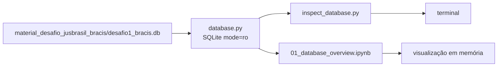

# Especificação — bootstrap inicial

## Objetivo

Estruturar o repositório para explorar o banco canônico do desafio BRACIS
Jusbrasil de modo reprodutível e exclusivamente read-only. Esta etapa não
implementa extração, normalização, classificação ou resolução de citações.

## Organização dos dados

Os arquivos distribuídos permanecem em
`material_desafio_jusbrasil_bracis/`, incluindo `desafio1_bracis.db`,
`goldenset.csv` e `txt/`. O SQLite, com aproximadamente 89 MiB, não será
copiado nem ligado simbolicamente para `data/`.

O diretório `data/` existirá como ponto de documentação e conterá um
`README.md` curto que declara a localização da fonte de dados. O código
localizará explicitamente o banco no diretório original. Isso preserva a
distribuição recebida e evita duplicação de dados grandes.

## Componentes

### Pacote Python

O projeto usará Python 3.11 ou superior, `setuptools` e o layout `src/`:

```text
src/bracis_jusbrasil/
├── __init__.py
└── database.py
```

`database.py` concentrará a localização do SQLite e a função pública
`connect_database(path, read_only=True)`. A conexão padrão usará URI SQLite
com `mode=ro`, não criará banco quando o caminho for inválido e configurará
`sqlite3.Row` como `row_factory`. Não haverá ORM, repository nem SQLAlchemy.

`pyproject.toml` permitirá `pip install -e .`, de modo que scripts e
notebooks importem `bracis_jusbrasil` normalmente, sem alteração de
`sys.path`. `requirements.txt` conterá somente a instalação editável,
JupyterLab, ipykernel, pandas e matplotlib.

### Script de inspeção

`scripts/inspect_database.py` será um entrypoint reprodutível que localiza o
banco e o abre exclusivamente pelo módulo reutilizável. Ele executará
`PRAGMA integrity_check`, listará as tabelas relevantes, mostrará o total de
documentos, as contagens por `natureza`, os acórdãos por tribunal e a presença
da tabela FTS5. A conexão será sempre fechada e nenhuma instrução de escrita
será executada.

### Notebook

`notebooks/01_database_overview.ipynb` será executável do início ao fim e
reutilizará o pacote instalado. Terá seções Markdown claras e consultas SQL
explícitas e pequenas:

1. Setup, caminhos, conexão read-only e versões.
2. Objetos de `sqlite_master`, schema de `documentos`, FTS e índices.
3. Totais, distribuições por natureza, tipo, tribunal e ano, com gráficos
   simples apenas quando úteis.
4. Metadados e início de texto de exemplos de cada natureza.
5. Múltiplos cabeçalhos de acórdãos de STF, STJ, TSE, TST e STM.
6. Os cinco registros de súmula, tornando observável a presença ou ausência
   de seu número no texto.
7. Os treze dispositivos legais e trechos relevantes.
8. Uma função exploratória de FTS5 que exibe resultados, tribunal, posição
   aproximada e contexto, sem se tornar um resolvedor.
9. Grupos de textos duplicados, calculados em memória por hash e sem
   persistência no SQLite.
10. Findings finais, distinguindo fatos comprovados de dúvidas abertas.

O notebook não utilizará o goldenset para construir uma solução e não exibirá
documentos completos por padrão.

### Documentação

O README da raiz permanecerá breve: objetivo, estrutura, comandos de
bootstrap, Jupyter e sanity check. A documentação MkDocs terá páginas sobre
arquitetura, notebooks e scripts, acessíveis a partir do índice que já
apresenta o desafio. A página de arquitetura descreverá somente os componentes
existentes e indicará parsing, normalização, índice canônico e resolução como
evoluções futuras, ainda não implementadas.

## Fluxo de dados e limites



Todo acesso ao SQLite usará uma conexão read-only. Não serão executados DDL,
DML, pragmas mutáveis ou persistência de hashes/resultados no banco.

## Falhas previstas

- Se o banco não estiver presente na localização documentada, a descoberta de
  caminho falhará com uma mensagem objetiva, sem criar um arquivo SQLite vazio.
- Falhas de integridade ou de schema serão exibidas pelo script ou pela célula
  correspondente do notebook e interromperão a exploração, em vez de produzir
  uma inferência silenciosamente incorreta.
- Consultas exploratórias limitarão linhas e texto exibido para manter as
  saídas legíveis.

## Validação

Após a implementação, serão executados:

```bash
python -m compileall src scripts
pip install -e .
python -c "import bracis_jusbrasil"
python scripts/inspect_database.py
jupyter nbconvert --to notebook --execute notebooks/01_database_overview.ipynb --output /tmp/01_database_overview.executed.ipynb
mkdocs build --strict --site-dir /tmp/bracis_jusbrasil_docs_site
```

Os comandos verificam sintaxe, packaging, acesso read-only, execução completa
do notebook e integridade do site de documentação.
